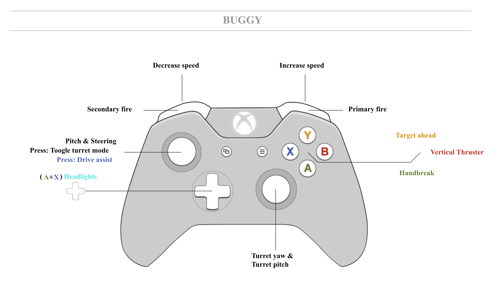
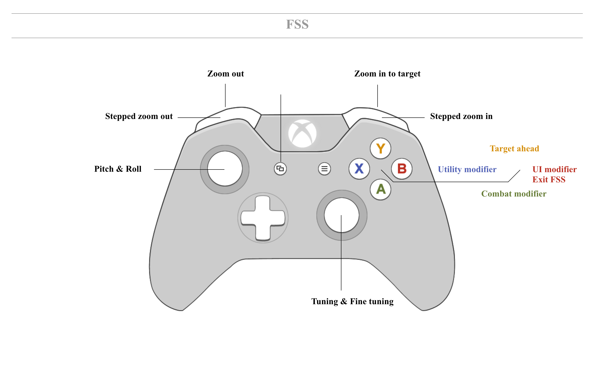

# Dahkron's Elite:Dangerous Binds

## Rationale

There are three role specific modifier buttons.   is for combat,  is for ui and  is for utilities.  That way there's one less thing for me to think about and I just know that for example holding A yields combat related actions (targeting, hardpoints, weapon groups, etc).

 has one single purpose, which is to target ahead.

### Bindings






## Installing

1. Start &rarr; Run &rarr; `%LOCALAPPDATA%`
2. Go to Frontier Developments &rarr; Elite Dangerous &rarr; Options &rarr; Bindings
3. Copy [Dahkron-Xbox.binds](Dahkron-Xbox.binds) or [Dahkron-PS4.binds](Dahkron-PS4.binds) into Bindings folder (right click and save either of these links)
4. Run Elite, go to controls options and select it from the preset menu

## Changes

##### 7/07/19
* Added FSS mode
* Added misc UI modes
* Updated xbox controls to latest game version

##### 18/07/14

* Redone all pictures with evolus/pencil, kept the source for future editing
* Added one for the buggy, I'm unhappy with vertical thruster on B (hard to open panels)
* It's ugly I know. Waiting to improve bindings before fine tuning the pictures

##### 18/07/08

* FLIGHT THRUST > VERTICAL THRUST AXIS: added small deadzone
* FLIGHT LANDING OVERRIDES: Added Forward and Backward Thrust on dpad_up and down
* FLIGHT MISCELLANEOUS: Swap "warp" binding to "Toggle Frame Shift Drive"
* MISCELLANEOUS > SHIP LIGHTS : ++dpad_up
* MODE SWITCHES > AUTO FOCUS ON TEXT INPUT FIELD: off (was on)
* UPTHRUSTBUTTON: keyboard binding was W►up S►down now is R►up F►down
* Added keyboard bindings for WINGMAN and NAV LOCK (7890-)
* Rearranged the XML to match the order the game wants. Now it's easier to use a diff-tool
* Added binding for ground vehicules
* Converted to new buttons names :
```
Pad_DPadUp    ► GamePad_DPadUp
Pad_DPadDown  ► GamePad_DPadDown
Pad_DPadLeft  ► GamePad_DPadLeft
Pad_DPadRight ► GamePad_DPadRigh
Pad_Start     ► GamePad_Start
Pad_Back      ► GamePad_Back
Pad_LThumb    ► GamePad_LThumb
Pad_RThumb    ► GamePad_RThumb
Pad_LBumper   ► GamePad_LBumper
Pad_RBumper   ► GamePad_RBumper
Pad_A         ► GamePad_FaceDown
Pad_B         ► GamePad_FaceRight
Pad_X         ► GamePad_FaceLeft
Pad_Y         ► GamePad_FaceUp
Pad_LStickX   ► GamePad_LStickX
Pad_LStickY   ► GamePad_LStickY
Pad_RStickX   ► GamePad_RStickX
Pad_RStickY   ► GamePad_RStickY
Pad_LTrigger  ► Pos_GamePad_LTrigger
Pad_RTrigger  ► Pos_GamePad_RTrigger
Pad_Unplugged ► GamePad_Unplugged
```

##### 17/03/15

 * Added a PS4 binds file (thanks to my mate Jon!)

##### 22/01/15

* Moved jettison cargo to ++RThumb as it conflicted with ship lights on the same binding. Ship lights are +RThumb. This puts all the 'smuggle' type actions together on +.
* Added ++LBumper and ++RBumper to set thrust to 0 and 75% respectively.
* Removed the crosshair.  Sorry, it bugged me.  You can turn it on again by switching on 'Show mouse widget' in the control options after you've loaded the preset.

##### 20/01/15

* Fixed a couple of errors on the diagrams.

## Contributing

Please feel free to fork, submit pull requests and/or create issues.
