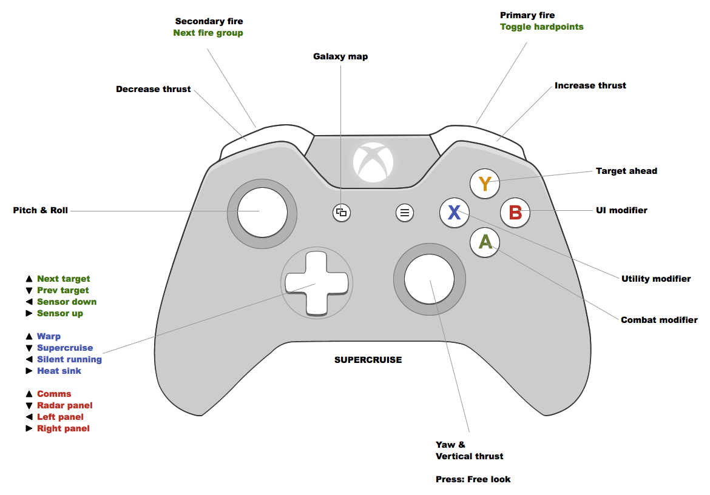
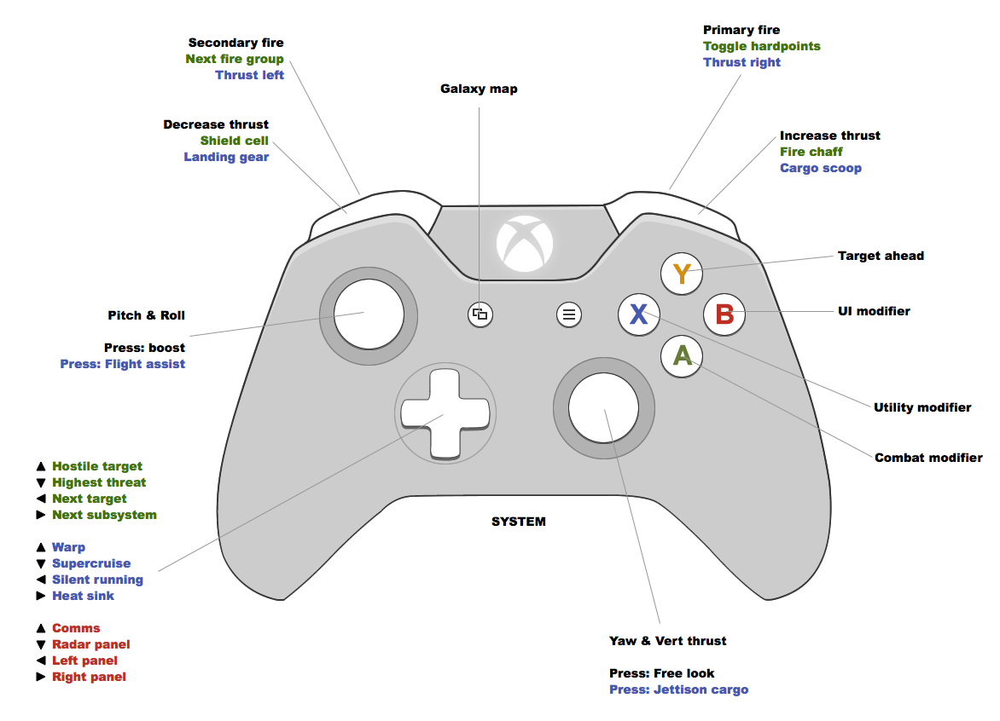
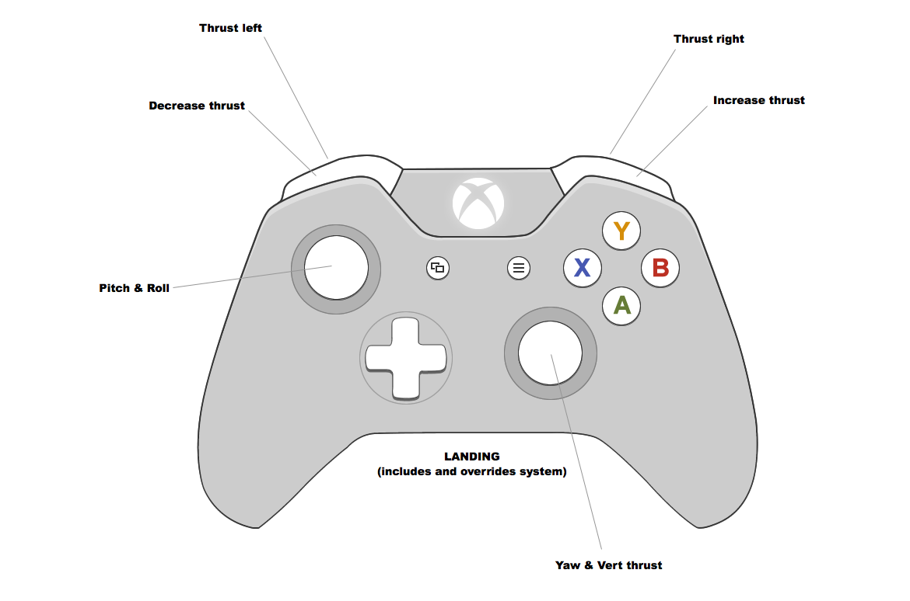

# Dahkron's Elite:Dangerous Binds

I'm currently using an Xbox controller with which I first used the advanced joypad configuration, but found it didn't quite do everything I wanted and I still had to reach for the keyboard from time to time.  So I tried using [this guy's config](https://forums.frontier.co.uk/showthread.php?t=71532) and whilst it's really good I had trouble remembering what was what and it didn't feel entirely logical to me.

So after much tweaking and experimentation I've created my own, based somewhat on the one above (same keyboard binds, for example) and arranged it in a way that is much easier for me to remember and still has everything I could possibly need at my fingertips.

I wondered if other Xbox controller users might be interested in trying it too.

## Rationale

There are three role specific modifier buttons.   is for combat,  is for ui and  is for utilities.  That way there's one less thing for me to think about and I just know that for example holding A yields combat related actions (targeting, hardpoints, weapon groups, etc).

 has one single purpose, which is to target ahead.

### Bindings

## Installing

1. Start &rarr; Run &rarr; `%LOCALAPPDATA%`
2. Go to Frontier Developments &rarr; Elite Dangerous &rarr; Options &rarr; Bindings
3. Copy [Dahkron-Xbox.binds](https://raw.githubusercontent.com/cmdrdahkron/elite-binds/master/Dahkron-Xbox.binds) into Bindings folder (right click and save)
4. Run Elite, go to controls options and select it from the preset menu

## Contributing

Please feel free to fork, submit pull requests and/or create issues.
